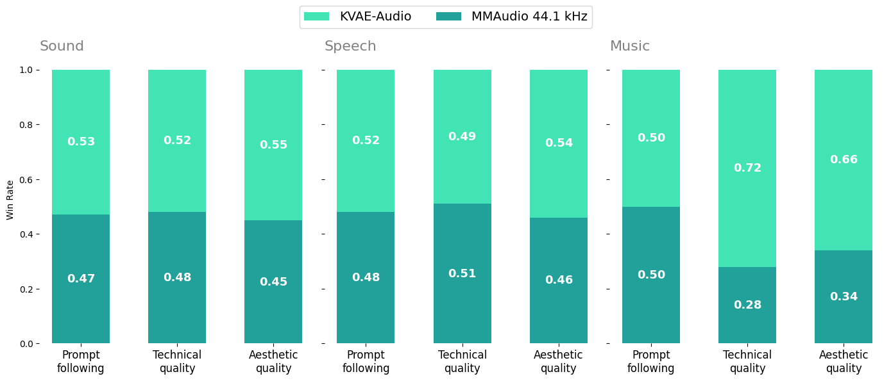
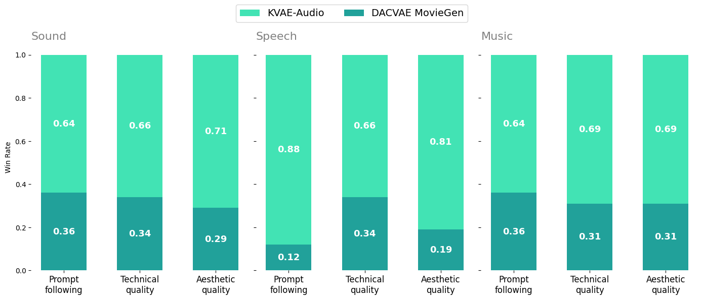
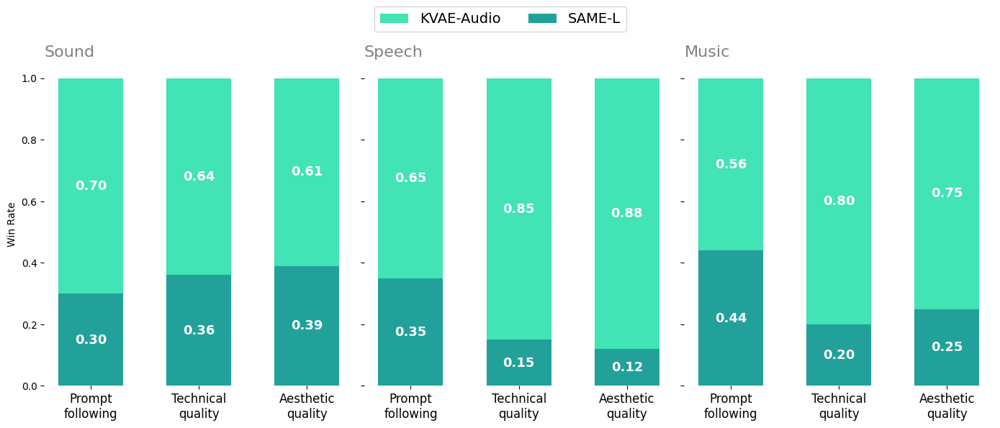

<div align="center">

  <picture>
    <source media="(prefers-color-scheme: dark)" srcset="assets/kvae_audio_white.png">
    <source media="(prefers-color-scheme: light)" srcset="assets/kvae_audio_black.png">
    
  </picture>

  <a href="https://huggingface.co/kandinskylab/KVAE-Audio">🤗HuggingFace</a> | <a href="https://github.com/kandinskylab/kvae">KVAE GitHub</a> | <a href="https://habr.com/ru/companies/sberbank/articles/1053410/">Habr article</a> | <a href="https://kandinskylab.ai/">Project Page</a> | Technical Report (soon)
</div>

<h1>KVAE-Audio</h1>

**KVAE-Audio** is a continuous, full-band (48 kHz) audio autoencoder. It compresses raw waveforms into compact continuous latents and reconstructs them with high fidelity across speech, music, and general sound. The model is designed not only for faithful reconstruction, but as a _latent space for generative models_ — in our internal text-to-audio pipeline, swapping the autoencoder for KVAE-Audio improves generation quality under a fixed generator.

## Inference instruction

### Setup

First install PyTorch (adjust for your CUDA setup):

```bash
pip install torch==2.11.0 torchvision==0.26.0 torchaudio==2.11.0 --index-url https://download.pytorch.org/whl/cu128
```

Then install KVAE-Audio from the local package:

```bash
pip install -e ./kvae-audio
```

Tested with Python 3.14.

### Run inference

Place input wavs in `input_samples`. Reconstructions are written to `output_samples`.

```bash
python scripts/infer.py \
  --weights_path kvae-audio.pt \
  --input_path input_samples \
  --output_path output_samples
```

### Evaluate reconstructions

Compare reference wavs in `input_samples` against reconstructions in `output_samples` (same filenames). Writes `metrics.csv` to `output_samples`.

```bash
python scripts/eval.py \
  --input_path input_samples \
  --output_path output_samples
```

### Python API

By default `encode` returns the mean latent (`mu`); pass `sample=True` for stochastic sampling. For end-to-end reconstruction, `model(waveform, sample_rate)["audio"]` is equivalent.

```python
import torch
import soundfile as sf
from kvae_audio import KVAEAudio

model = KVAEAudio.load("kvae-audio.pt", map_location="cpu")
model.eval()

data, sr = sf.read("audio.wav")
waveform = torch.from_numpy(data).float().unsqueeze(0).unsqueeze(0)
length = waveform.shape[-1]

with torch.no_grad():
    latents, _, _, _ = model.encode(waveform, sample_rate=sr)
    audio = model.decode(latents)[..., :length]

sf.write("output.wav", audio.squeeze(0).T.numpy(), sr)
```

## Evaluation results

### Reconstructions

Reconstruction is evaluated on open datasets across domains (the released weights directly substantiate these numbers). Baselines: **[MMAudio 44.1 kHz](https://arxiv.org/abs/2412.15322)** VAE, **[DACVAE from MovieGen Audio](https://arxiv.org/abs/2410.13720)**, **[SAME-L](https://arxiv.org/abs/2605.18613)** (Stable Audio 3 VAE).

#### AudioSet eval

| Model           | # Params | Latent dim | MEL↓      | STFT↓     | Waveform↓ | SI-SDR↑   | SDR↑       | SNR↑       |
| --------------- | -------- | ---------- | --------- | --------- | --------- | --------- | ---------- | ---------- |
| MMAudio 44.1kHz | 427.6M   | 40         | *0,636*   | *1,938*   | 0,106     | -32,080   | -2,682     | -2,686     |
| DACVAE MovieGen | 107.7M   | 128        | 0,669     | 2,275     | 0,029     | 8,384     | 9,421      | 9,416      |
| SAME-L          | 852.1M   | 256        | 0,986     | 2,726     | *0,027*   | **9,586** | **10,347** | **10,339** |
| KVAE-Audio      | 166.9M   | 64         | **0,537** | **1,770** | **0,027** | *9,065*   | *9,920*    | *9,933*    |

#### MUSDB18-HQ

| Model           | # Params | Latent dim | MEL↓      | STFT↓     | Waveform↓ | SI-SDR↑    | SDR↑       | SNR↑       |
| --------------- | -------- | ---------- | --------- | --------- | --------- | ---------- | ---------- | ---------- |
| MMAudio 44.1kHz | 427.6M   | 40         | 0,681     | 1,865     | 0,114     | -40,204    | -3,274     | -3,273     |
| DACVAE MovieGen | 107.7M   | 128        | *0,519*   | *1,762*   | 0,024     | 9,688      | 10,046     | 10,047     |
| SAME-L          | 852.1M   | 256        | 0,668     | 1,786     | *0,023*   | *10,278*   | *10,648*   | *10,648*   |
| KVAE-Audio      | 166.9M   | 64         | **0,516** | **1,725** | **0,022** | **10,390** | **10,675** | **10,677** |

#### EARS

| Model           | # Params | Latent dim | MEL↓      | STFT↓     | Waveform↓ | SI-SDR↑    | SDR↑       | SNR↑       | PESQ↑     |
| --------------- | -------- | ---------- | --------- | --------- | --------- | ---------- | ---------- | ---------- | --------- |
| MMAudio 44.1kHz | 427.6M   | 40         | 0,616     | 1,395     | 0,030     | -29,947    | -2,728     | -2,697     | 2,424     |
| DACVAE MovieGen | 107.7M   | 128        | **0,453** | **1,310** | *0,006*   | **10,264** | **10,680** | **10,681** | *4,246*   |
| SAME-L          | 852.1M   | 256        | 0,774     | 1,575     | 0,007     | 9,939      | 10,374     | 10,376     | 2,982     |
| KVAE-Audio      | 166.9M   | 64         | *0,463*   | *1,314*   | **0,006** | *9,952*    | *10,377*   | *10,384*   | **4,266** |

### Evaluation of latent space qualities for generation

Generative quality is established under a **fixed generator** — same DiT architecture, training data, and number of steps — varying only the autoencoder. We report objective generation metrics and blind human side-by-side below.

### AudioCaps test set

| Model           | # Params | Latent dim | CLAP↑     | CE↑       | PQ↑       | FAD (PANNs)↓ | FAD (PASST)↓ | FAD (VGGIsh)↓ |
| --------------- | -------- | ---------- | --------- | --------- | --------- | ------------ | ------------ | ------------- |
| MMAudio 44.1kHz | 427.6M   | 40         | *0,336*   | *3,909*   | *6,192*     | *17,873*       | *195,910*      | 1,364         |
| DACVAE MovieGen | 107.7M   | 128        | 0,313     | 3,772     | 6,167     | 20,558       | 234,312      | 1,700         |
| SAME-L          | 852.1M   | 256        | 0,322     | 3,588     | 5,756     | 18,446       | 240,635      | *1,325*       |
| KVAE-Audio      | 166.9M   | 64         | **0,344** | **3,982** | **6,242** | **15,381**   | **193,760**  | **1,210**     |

#### Song Describer

| Model           | # Params | Latent dim | CLAP↑     | CE↑       | PQ↑       | FAD (PANNs)↓ | FAD (PASST)↓ | FAD (VGGIsh)↓ |
| --------------- | -------- | ---------- | --------- | --------- | --------- | ------------ | ------------ | ------------- |
| MMAudio 44.1kHz | 427.6M   | 40         | **0,356** | *7,136*   | *7,707*   | **5,412**    | **158,599**  | **0,356**     |
| DACVAE MovieGen | 107.7M   | 128        | 0,312     | 6,953     | 7,538     | 10,194       | 214,009      | 1,046         |
| SAME-L          | 852.1M   | 256        | *0,345*   | 7,076     | 7,465     | 8,442        | 250,668      | 0,987         |
| KVAE-Audio      | 166.9M   | 64         | 0,339     | **7,216** | **7,929** | *7,971*        | *189,427*      | *0,599*         |

#### LibriSpeech test-clean

| Model           | # Params | Latent dim | CLAP↑     | CE↑       | PQ↑       | FAD (PANNs)↓ | FAD (PASST)↓ | FAD (VGGIsh)↓ | WER↓      | CER↓      |
| --------------- | -------- | ---------- | --------- | --------- | --------- | ------------ | ------------ | ------------- | --------- | --------- |
| MMAudio 44.1kHz | 427.6M   | 40         | 0,368     | *5,704*   | 6,629     | 8,305        | **105,931**  | *2,001*       | *0,257*   | *0,593*   |
| DACVAE MovieGen | 107.7M   | 128        | **0,413** | 5,482     | **7,052** | *5,008*      | 210,478      | **1,501**     | 0,911     | 1,048     |
| SAME-L          | 852.1M   | 256        | 0,379     | 4,617     | 5,024     | 10,257       | 301,508      | 2,721         | 0,349     | 0,629     |
| KVAE-Audio      | 166.9M   | 64         | *0,389*   | **5,906** | *6,940*   | **4,677**    | *185,609*    | 2,138         | **0,244** | **0,576** |








## Citation

```
@misc{kvae_audio_2026,
    author = {Ivan Kirillov, Denis Parkhomenko, Alexandr Ivanov, Azat Saginbaev, Egor Silvestrov},
    title = {KVAE-Audio: a full-band continuous audio tokenizer for generative models},
    howpublished = {\url{https://github.com/kandinskylab/kvae-audio}},
    year = 2026
}
```

## Package layout

```
kvae-audio/
├── kvae_audio/
│   ├── model/
│   │   ├── kvae_audio.py
│   │   └── base.py
│   ├── metrics/loss.py
│   └── nn/layers.py
└── scripts/
    ├── infer.py
    └── eval.py
```
